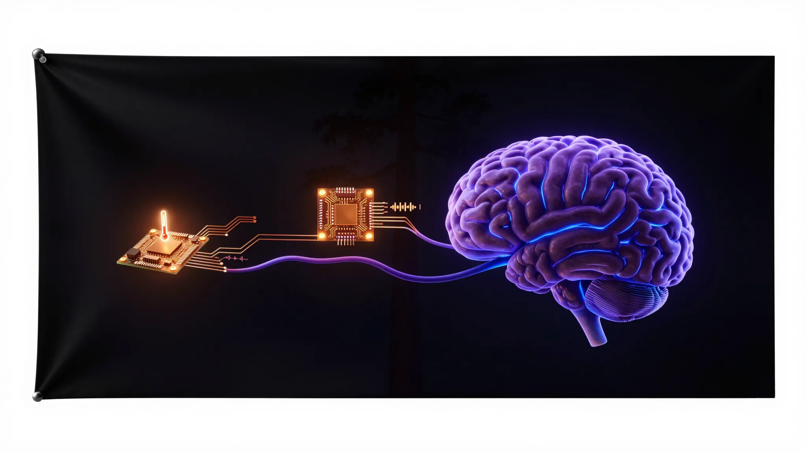

<div align="center">



<br/>

# ⚡ pico-nerve-endings

> **Try Claude free for 2 weeks** — the AI behind this entire ecosystem. [Start your free trial →](https://claude.ai/referral/4fAMYN9Ing)

---


**Raspberry Pi Pico 2 (RP2350) firmware and host scripts — the peripheral nervous system of ShaneBrain.**

[](LICENSE)
[](CONSTITUTION.md)
[](https://micropython.org/)
[](https://github.com/thebardchat/shanebrain-core)

*Sensors and speakers wired to the Pi 5 in Hazel Green, Alabama. Each project is self-contained — clone it, fork it, wire it up.*

</div>

---

## Projects

| Project | What It Does | Hardware | Fork It |
|---------|-------------|----------|---------|
| [audio-speaker](projects/audio-speaker/) | Receives WAV over USB serial, plays via I2S to MAX98357A amp | Pico 2 + MAX98357A + 4Ω speaker (~$15) | ✅ Ready |
| [temp-sensor](projects/temp-sensor/) | Reads onboard RP2350 temp sensor, streams JSON over USB serial | Pico 2 + USB cable (~$5) | ✅ Ready |

---

## Repo Structure

Each project folder is **fully self-contained**:

```
projects/<name>/
├── firmware/main.py      MicroPython firmware — flash directly to the Pico
├── host/<name>.py        Pi-side Python script — reads or writes serial
├── system/               systemd service/timer files for the Pi
├── wiring.md             Pinout, BOM, hardware diagram
└── README.md             Everything you need to build and run it
```

Shared across all projects:
```
shared/udev/99-pico-serial.rules    Stable /dev/pico-* symlinks by USB serial number
CLAUDE.md                           AI session context — hardware, protocol, flash commands
CONSTITUTION.md                     The governing covenant for this ecosystem
```

---

## Quick Start

1. Pick a project from the table above
2. Open its folder and read the `README.md`
3. Flash `firmware/main.py` with Thonny or `mpremote`
4. Run the host script on your Pi
5. Done

Full setup details including udev rules, systemd services, and serial protocol in [CLAUDE.md](CLAUDE.md).

---

## Adding a New Project

```
projects/my-new-thing/
├── firmware/main.py    # MicroPython — what runs on the Pico
├── host/my-thing.py   # Python — what runs on the Pi
├── system/            # systemd files if needed
├── wiring.md          # Pinout and BOM
└── README.md          # Standalone docs
```

Add a row to the project table above and a udev rule in `shared/udev/99-pico-serial.rules`.

---

## Governing Document

This project operates under the [ShaneBrain Constitution](CONSTITUTION.md).

> *"Whatever you do, work at it with all your heart, as working for the Lord, not for human masters."*
> — Colossians 3:23

---

<div align="center">

*Part of the [thebardchat](https://github.com/thebardchat) ecosystem — built on a Pi 5 in Hazel Green, Alabama.*

*Faith · Family · Sobriety · Local AI · The Left-Behind User*

</div>
